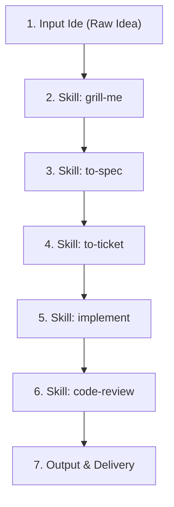

# Idea Orchestrator - End-to-End SDD Pipeline Skill

Automates the complete transformation of raw user ideas into production-ready features via a 7-stage Spec-Driven Development (SDD) pipeline.

## Pipeline Execution Workflow

### Stage 1: Input Ide (Raw Feature Concept)
- Capture the user's raw idea, intent, or high-level request.
- Acknowledge the concept and initialize the SDD pipeline context.

### Stage 2: Skill `grill-me` (Stress-Test & Align)
- Invoke the **`grill-me`** skill.
- Conduct a focused interview (asking 1 question at a time with recommended answers).
- Inspect the codebase first so technical details already present are not asked of the user.
- Resolve all design decisions, user flows, edge cases, and state requirements until shared understanding is reached.

### Stage 3: Skill `to-spec` (Technical PRD & Spec Document)
- Invoke the **`to-spec`** skill.
- Transform the aligned decisions into a structured technical specification document (`PRD/Spec`).
- Save the spec to `docs/specs/` or artifact directory with clear scope, architecture, components, and verification plan.

### Stage 4: Skill `to-ticket` (Ticket Decomposition)
- Invoke the **`to-ticket`** skill.
- Decompose the technical spec into sequential, bounded implementation tickets.
- Define explicit acceptance criteria and verification steps for each ticket.

### Stage 5: Skill `implement` (Step-by-Step Code Execution)
- Invoke the **`implement`** skill.
- Execute ticket-by-ticket code changes adhering to project coding standards and patterns.
- Run empirical verification commands (`npm run build`, linting, or unit tests) after each ticket.

### Stage 6: Skill `code-review` (Spec-Aware Code Audit)
- Invoke the **`code-review`** skill.
- Evaluate all modified files against the original specification (`to-spec`), security standards, error handling, and performance.
- Fix any identified lint, type, or contract discrepancies.

### Stage 7: Output & Delivery
- Summarize changes in a clear walkthrough document (`walkthrough.md`).
- Run final production build verification.
- Stage, commit, and push the verified changes to the Git repository.
