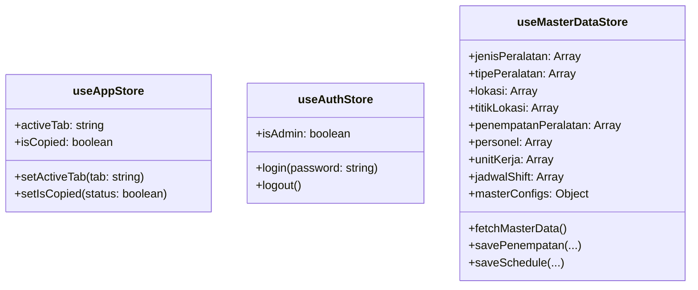

# System Architecture Document
## SSES T2 Generator Laporan Operasional

---

## 1. Ikhtisar Arsitektur Sistem

Aplikasi **SSES T2 Generator Laporan** dibangun menggunakan arsitektur **Single Page Application (SPA) Mobile-First** berbasis **React 19**, **TypeScript 5**, **TanStack Router/Start**, dan **Vite 7** (dengan plugin HTTPS `@vitejs/plugin-basic-ssl`). Aplikasi menggunakan **Supabase PostgreSQL** sebagai backend database utama, dikombinasikan dengan **Cloudinary** sebagai penyimpanan foto dokumentasi berbasis Global CDN berkecepatan tinggi (~300–600ms).

```mermaid
graph TD
    User([User / Mobile Browser]) --> UI[React 19 Mobile-First UI\n12 Modul Tab + Touch Swipe Navigation + AntigravityPet Mascot]
    UI --> Router[TanStack Router]
    UI --> Store[Zustand Stores\nuseAppStore | useAuthStore | useMasterDataStore]
    UI --> Services[Service Layer\noperationalReportService | cloudinaryService | pdfService | shareService | checklistSyncService]
    
    Store <--> LocalStorage[(Browser LocalStorage\nDraf, Cloudinary Config & Master Fallback)]
    Store <--> Supabase[(Supabase Cloud Backend\nAuth | PostgreSQL | Realtime)]
    Services <--> Supabase
    
    Services --> CloudStorage{Cloud Photo Storage\ncloudinaryService.ts}
    CloudStorage --> Cloudinary[(Cloudinary Global CDN\nFolder: SSES_T2_Dokumentasi)]
    
    UI --> WAGen[WA Generator\nwaGenerator.ts]
    UI --> CanvasEngine[Canvas, Konva & Signature Engine\nPhoto Annotation, Live Collage, SignaturePad]
    
    WAGen --> WAShare[Web Share API Instant Gesture\nWhatsApp Direct Link]
    Services --> PDFGen[PDF Generator\nhtml2pdf.js Non-blocking Offload]
```

---

## 2. Stack Teknologi & Dependensi

| Layer | Teknologi / Library | Versi | Peran & Alasan Pemilihan |
|---|---|---|---|
| **Core Framework** | React | `19.2.5` | UI Library utama dengan dukungan Concurrent Features terbaru. |
| **Language** | TypeScript | `5.9.3` | Type safety penuh di seluruh lapisan aplikasi. |
| **Build Tool** | Vite | `7.3.3` | Fast HMR & bundling performa tinggi. |
| **Dev Server SSL** | `@vitejs/plugin-basic-ssl` | `1.2.0` | HTTPS lokal untuk mengaktifkan Web Share API & Camera API pada perangkat mobile di jaringan LAN. |
| **Routing & Framework** | TanStack Router / Start | `1.168.22` / `1.167.41` | Type-safe routing & modern layout management. |
| **Styling** | Tailwind CSS | `4.2.2` | Framework utility-first untuk desain responsif & konsisten. |
| **State Management** | Zustand | `5.0.14` | Client-side state management yang ringan dan reaktif. |
| **Database & Auth** | `@supabase/supabase-js` | `2.108.2` | Client REST & Realtime PostgreSQL + Authentication. |
| **Cloud Storage** | Cloudinary CDN | Unsigned REST API | Penyimpanan foto terkompresi berbasis Global CDN (~300-600ms), 25 GB free/bulan. |
| **Canvas & Anotasi** | Konva / `react-konva` | `10.3.0` / `19.2.5` | Engine render canvas 2D untuk anotasi foto & text overlay. |
| **Digital Signature** | HTML5 Canvas Signature Pad | Native | Input tanda tangan digital untuk Berita Acara Serah Terima. |
| **Spreadsheet & Import** | SheetJS (`xlsx`) | `0.18.5` | Parsing berkas Excel jadwal shift harian secara client-side. |
| **Ekspor PDF/Canvas** | `html2pdf.js` / `html2canvas` | `0.14.0` / `1.4.1` | Generator PDF terisolasi (`pdfService.ts`) mencegah UI freeze. |
| **Testing** | Node.js Test Runner | `node --test` | Unit testing bawaan Node.js tanpa dependensi runner eksternal. |
| **Icon System** | Lucide React | `0.576.0` | Set ikon UI modern & konsisten. |
| **Hosting & Deploy** | Netlify | - | Static Web Hosting & Serverless SSR. |

---

## 3. Struktur Direktori Kode (`src/`)

```
src/
├── components/
│   ├── App.tsx                     # Root Layout: Header status, Tab Navigation (12 tab), Floating Share, & AntigravityPet
│   ├── features/                   # Komponen Fitur (12 Tab Modul, Admin CRUD, Mascot)
│   │   ├── AntigravityPet.tsx      # Floating Chibi Iron Man mascot dengan zero-g physics & dialog operasional
│   │   ├── CloudinarySettingsPanel.tsx # Pengaturan Cloudinary CDN (Cloud Name & Upload Preset) di Tab Data
│   │   ├── TabKehadiran.tsx        # Laporan kehadiran shift (API & OM IAS)
│   │   ├── TabBriefing.tsx         # Laporan kegiatan briefing & sparepart
│   │   ├── TabStoring.tsx          # Laporan storing peralatan
│   │   ├── TabChecklist.tsx        # Checklist operasi peralatan
│   │   ├── TabInitialReport.tsx    # Laporan awal gangguan (Smart Mitigasi & Dampak)
│   │   ├── TabPerbaikan.tsx        # Laporan perbaikan (Auto Sumber Laporan Avsec/Custom)
│   │   ├── TabKalibrasi.tsx        # Laporan PM & kalibrasi peralatan (termasuk Extension Conveyor)
│   │   ├── TabKegiatan.tsx         # Laporan kegiatan harian
│   │   ├── TabBASerahTerima.tsx    # Berita Acara Serah Terima Barang & Tanda Tangan
│   │   ├── TabShiftReport.tsx      # Rekapitulasi pergantian shift & Interactive Serviceability Diagram
│   │   ├── TabTip.tsx              # Tracker TIP performance & chart
│   │   ├── TabData.tsx             # Panel Admin Data, Authentication & Cloudinary Settings
│   │   ├── AssetManager.tsx        # CRUD Manajemen penempatan relasional aset
│   │   ├── AssetMasterLokasi.tsx   # CRUD Master Lokasi & Titik Lokasi
│   │   ├── AssetMasterPeralatan.tsx# CRUD Master Jenis & Tipe Peralatan
│   │   ├── UnitPeralatanManager.tsx# CRUD Unit Peralatan (SN, status operasi, kepemilikan)
│   │   ├── SparepartManager.tsx    # CRUD Stok Sparepart & Briefing Toggle
│   │   ├── ChecklistDataEditor.tsx # Konfigurasi editor item checklist
│   │   └── ScheduleUploader.tsx    # Parser & Uploader Jadwal Shift Excel
│   └── shared/                     # Reusable UI Components
│       ├── PhotoUploader.tsx       # Photo upload, reorder, and management component
│       ├── LiveCollagePreview.tsx  # Dynamic multi-layout collage generator (Canvas API)
│       ├── PhotoTextEditorModal.tsx# Photo text annotation modal (Konva Canvas)
│       ├── SignaturePad.tsx        # Digital signature pad component (Canvas)
│       └── MonitorSearchIcon.tsx   # Custom MonitorSearch icon
├── lib/
│   ├── data/
│   │   ├── constants.ts            # Key konstanta localStorage & app configuration
│   │   └── masterData.ts           # Initial fallback master data, hirarki jabatan, & helper formatting
│   ├── services/
│   │   ├── checklistSyncService.ts # Sinkronisasi checklist status harian ke cloud
│   │   ├── cloudinaryService.ts    # Upload foto ke Cloudinary via Unsigned Upload Preset
│   │   ├── operationalReportService.ts # Layanan log operasional & kesiapan peralatan (serviceability)
│   │   ├── pdfService.ts           # Dynamic import PDF generator non-blocking
│   │   └── shareService.ts         # Utility Web Share API & Clipboard fallback sanitasi
│   ├── utils/
│   │   ├── waGenerator.ts          # Template engine pesan WhatsApp untuk 12 tab
│   │   ├── locationRules.ts        # Business logic filter lokasi relasional
│   │   └── canvasUtils.ts          # Utility kompresi & pembuatan kolase foto HTML5 Canvas
│   └── supabaseClient.ts           # Inisialisasi Supabase Client & environment setup
├── store/
│   ├── useAppStore.ts              # State UI global (activeTab, toast, status UI)
│   ├── useAuthStore.ts             # State autentikasi Admin
│   └── useMasterDataStore.ts       # State master data, spareparts, & metode pencocokan relasi
├── routes/
│   ├── __root.tsx                  # Root HTML Shell & Meta Viewport setup
│   └── index.tsx                   # Route "/" -> render App component
├── router.tsx                      # Inisialisasi TanStack Router
├── routeTree.gen.ts                # Auto-generated route tree
└── styles.css                      # Tailwind CSS v4 imports, zero-g & thruster keyframe animations
```

---

## 4. Arsitektur State Management (Zustand)

Aplikasi menggunakan 3 Zustand Store terpisah untuk menjaga kebersihan pemisahan tanggung jawab (*separation of concerns*):



1. **`useAppStore`**: Mengelola state transient UI seperti tab aktif (`activeTab`), notifikasi penyalinan teks (`isCopied`), dan modal state.
2. **`useAuthStore`**: Mengelola sesi login Admin untuk mengakses tab **Data** dan mengubah master data.
3. **`useMasterDataStore`**: Mengelola data operasional relasional. Melakukan *sync* otomatis dari Supabase saat aplikasi diinisialisasi, dan menyediakan fallback ke `localStorage` jika terjadi gangguan jaringan.

---

## 5. Service Layer & Business Logic

### 5.1. Log Operasional & Serviceability (`operationalReportService.ts`)
Mengelola persistensi data kegiatan shift dan status kelaikan peralatan ke tabel Supabase `laporan_operasional` dan `laporan_checklist`.
* **Aturan Batas Shift (Shift Boundary Rules)**:
  * **Shift PS (Pagi/Siang)**: Jam dinas 08:00 s.d. 20:00 WIB.
  * **Shift M (Malam)**: Jam dinas 20:00 s.d. 08:00 WIB (mencakup dini hari hari berikutnya).
* **Otomasi Default Tanggal & Shift Laporan**:
  * Pukul `00:00 - 09:59`: Tanggal hari sebelumnya, Shift M.
  * Pukul `10:00 - 21:59`: Tanggal hari ini, Shift PS.
  * Pukul `22:00 - 23:59`: Tanggal hari ini, Shift M.
* **Kalkulasi Kesiapan Peralatan**:
  Mengagregasi total unit operasi vs rusak untuk X-Ray, WTMD, HHMD, Body Scanner, ETD, Access Control, dan CCTV untuk menampilkan skor kesiapan operasional bandara.
* **Deduplikasi Log & Non-blocking Background Sync**:
  Menerapkan mekanisme in-memory lock `recentOperationalLogs` (window 30 detik) untuk mencegah duplikasi baris saat tombol simpan/share ditekan berulang. Pemicu Web Share API dieksekusi secara instan, sedangkan upload foto dan persistensi Supabase berjalan asinkron di latar belakang.

### 5.2. Cloud Photo Upload Pipeline (`cloudinaryService.ts`)
Untuk menjaga ukuran database PostgreSQL tetap hemat dan performa aplikasi tetap cepat, sistem menerapkan pipeline penyimpanan foto berbasis Cloudinary Global CDN:
1. **Kompresi Canvas Otomatis**: Setiap foto kamera beresolusi tinggi (3–8 MB) secara otomatis dikompresi menjadi Blob JPEG 80% dengan batas resolusi maksimum 1280px (~150–250 KB) melalui Canvas API.
2. **Cloudinary Unsigned Upload**: Foto diunggah langsung ke endpoint `https://api.cloudinary.com/v1_1/${cloudName}/image/upload` menggunakan *Unsigned Upload Preset*. File disimpan ke folder `SSES_T2_Dokumentasi` dan langsung mengembalikan URL HTTPS permanen dari CDN global Cloudinary (~300–600ms).
3. **Perlindungan Anti-Base64**: Database membatasi bahwa kolom `foto_urls` hanya menerima array URL HTTPS yang valid. String Data URL Base64 dilarang masuk ke PostgreSQL oleh constraint database `chk_foto_urls_no_base64`.

### 5.3. Pipeline Pemrosesan Foto & Anotasi (Canvas Engine)
```
[Upload Foto User (Kamera / Galeri)] 
       │
       ▼
[PhotoUploader.tsx] ──(Edit Anotasi Teks)──► [PhotoTextEditorModal.tsx (Konva.js)]
       │                                                    │
       │◄────────────────(Export Hasil Anotasi)─────────────┘
       ▼
[LiveCollagePreview.tsx] ──(Canvas Render Grid & Kompresi JPEG 1280px)
       │
       ▼
[cloudinaryService.ts Upload]
       └──► [Cloudinary Global CDN: Folder SSES_T2_Dokumentasi via Unsigned Preset]
       │
       ▼
[HTTPS Public Image URLs] ──► [Database: laporan_operasional.foto_urls]
                          ──► [Direct Link WhatsApp & Shift Report Photo Modal]
```

### 5.4. Non-blocking PDF Generation (`pdfService.ts`)
Menggunakan dynamic import `html2pdf.js` untuk merender elemen dokumen DOM (seperti BA Serah Terima) ke PDF secara asinkron tanpa memblokir thread UI utama, mencegah freeze pada browser mobile saat pemrosesan dokumen besar.

---

## 6. Alur Generator Pesan WhatsApp (`waGenerator.ts`)

Setiap fitur memiliki fungsi pembentuk pesan khusus di `waGenerator.ts`:

```typescript
// Alur Transformasi Data Form -> Teks WA & Instant User Gesture Share
Form State (React) 
   ──► generateWAText(tabName, formData, masterData) 
   ──► Format Teks dengan Emoji & Monospace Markdown
   ──► Instant Web Share API (`navigator.share`) / Fallback `navigator.clipboard`
   ──► Direct Launch App WhatsApp
   ──► Background Async: Compress Photo -> Cloudinary Upload -> Supabase Log Save
```

---

## 7. Integrasi Backend Cloud (Supabase)

### Supabase Cloud Database & Storage
- **Database Relasional PostgreSQL**:
  - Master Peralatan (`jenis_peralatan`, `tipe_peralatan`, `penempatan_peralatan`, `unit_peralatan`).
  - Master Lokasi (`lokasi`, `titik_lokasi`).
  - Personel & Jadwal (`personel`, `unit_kerja`, `jadwal_shift`).
  - Inventaris (`spareparts`).
  - Data Operasional & Rekap (`laporan_operasional` dengan check constraint `chk_foto_urls_no_base64`, `laporan_checklist` dengan unique constraint `(tanggal, shift)` untuk atomic upsert).
  - Konfigurasi Fleksibel (`master_configs` - checklist & TIP performance).
- **Supabase Storage Bucket (`dokumentasi`)**:
  - Bucket publik fail-safe untuk penyimpanan file arsip.
  - Kebijakan RLS (Row Level Security) mengizinkan pembacaan publik dan insert foto dari aplikasi mobile.
- Menggunakan REST API Client (`@supabase/supabase-js`) dengan kunci anonim (`VITE_SUPABASE_ANON_KEY`).

---

## 8. Infrastruktur & Keamanan

1. **Environment Variables**:
   * `VITE_SUPABASE_URL`: Endpoint URL proyek Supabase.
   * `VITE_SUPABASE_ANON_KEY`: Kunci akses anonim Supabase.
   * `VITE_CLOUDINARY_CLOUD_NAME`: Cloud Name akun Cloudinary.
   * `VITE_CLOUDINARY_UPLOAD_PRESET`: Unsigned Upload Preset akun Cloudinary.
2. **Local HTTPS Development Server**:
   * Vite dikonfigurasi dengan plugin `@vitejs/plugin-basic-ssl` untuk menyajikan server pengembang melalui protokol HTTPS aman (`https://localhost:3000` & `https://<ip-lan>:3000`).
   * Protokol HTTPS diperlukan oleh browser modern untuk mengaktifkan Web Share API (`navigator.share`) dan akses Kamera di ponsel saat pengujian di jaringan lokal bandara.
3. **Mobile Viewport Optimization**:
   * Layout responsif menggunakan `meta viewport` dengan `viewport-fit=cover`.
   * Skala font minimum 16px pada elemen `<input>`, `<select>`, dan `<textarea>` untuk mencegah automatic page zooming pada iOS Safari.
4. **Pengujian Regresi**:
   * Menjalankan suite pengujian unit berbasis `node --test` pada direktori `tests/` untuk memvalidasi kepemilikan sub-tab dan aturan isolasi modul.

