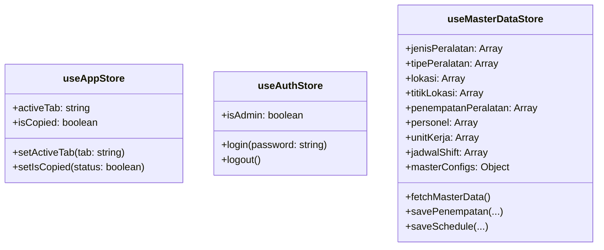

# System Architecture Document
## SSES T2 Generator Laporan Operasional

---

## 1. Ikhtisar Arsitektur Sistem

Aplikasi **SSES T2 Generator Laporan** dibangun menggunakan arsitektur **Single Page Application (SPA) Mobile-First** berbasis **React 19**, **TypeScript 5**, **TanStack Router/Start**, dan **Vite 7**. Aplikasi menggunakan **Supabase PostgreSQL** sebagai backend cloud utama dan **Google Apps Script (`Code.gs`)** sebagai backend pendukung untuk sinkronisasi Google Sheets & Drive Storage.

```mermaid
graph TD
    User([User / Mobile Browser]) --> UI[React 19 Mobile-First UI]
    UI --> Router[TanStack Router]
    UI --> Store[Zustand Stores\nuseAppStore | useAuthStore | useMasterDataStore]
    
    Store <--> LocalStorage[(Browser LocalStorage\nDraf & Master Fallback)]
    Store <--> Supabase[(Supabase Backend\nAuth | PostgreSQL | Realtime)]
    
    UI --> WAGen[WA Generator\nwaGenerator.ts]
    UI --> CanvasEngine[Canvas & Konva Engine\nPhoto Annotation & Live Collage]
    
    WAGen --> WAShare[Web Share API / WhatsApp Direct Link]
    
    UI --> SheetsService[Sheets Sync Service\nsheetsSyncService.ts]
    SheetsService <--> GAS[Google Apps Script\nCode.gs Web App]
    GAS <--> GSheets[(Google Sheets\nLaporan_Harian)]
    GAS <--> GDrive[(Google Drive\nSSES_Report_Images)]
```

---

## 2. Stack Teknologi & Dependensi

| Layer | Teknologi / Library | Versi | Peran & Alasan Pemilihan |
|---|---|---|---|
| **Core Framework** | React | `19.2.5` | UI Library utama dengan dukungan Concurrent Features terbaru. |
| **Language** | TypeScript | `5.9.3` | Type safety penuh di seluruh lapisan aplikasi. |
| **Build Tool** | Vite | `7.3.3` | Fast HMR & bundling performa tinggi. |
| **Routing & Framework** | TanStack Router / Start | `1.168.22` | Type-safe routing & modern layout management. |
| **Styling** | Tailwind CSS | `4.2.2` | Framework utility-first untuk desain responsif & konsisten. |
| **State Management** | Zustand | `5.0.14` | Client-side state management yang ringan dan reaktif. |
| **Database & Auth** | `@supabase/supabase-js` | `2.108.2` | Client REST & Realtime PostgreSQL + Authentication. |
| **Canvas & Anotasi** | Konva / `react-konva` | `10.3.0` / `19.2.5` | Engine render canvas 2D untuk anotasi foto & text overlay. |
| **Spreadsheet & Import** | SheetJS (`xlsx`) | `0.18.5` | Parsing berkas Excel jadwal shift harian secara client-side. |
| **Ekspor PDF/Canvas** | `html2pdf.js` / `html2canvas` | `0.14.0` / `1.4.1` | Generator PDF dan konversi DOM ke gambar PNG. |
| **Icon System** | Lucide React | `0.576.0` | Set ikon UI modern & konsisten. |
| **Hosting & Deploy** | Netlify + Google Apps Script | - | Static Web Hosting + Webhook Serverless API. |

---

## 3. Struktur Direktori Kode (`src/`)

```
src/
├── components/
│   ├── App.tsx                     # Root Layout: Header status, Tab Navigation (11 tab), Floating Share
│   ├── features/                   # Komponen Fitur (11 Tab Modul & Admin CRUD)
│   │   ├── TabKehadiran.tsx        # Laporan kehadiran shift (API & OM IAS)
│   │   ├── TabBriefing.tsx         # Laporan kegiatan briefing
│   │   ├── TabStoring.tsx          # Laporan storing peralatan
│   │   ├── TabChecklist.tsx        # Checklist operasi peralatan
│   │   ├── TabInitialReport.tsx    # Laporan awal indikasi gangguan peralatan
│   │   ├── TabPerbaikan.tsx        # Laporan perbaikan/verifikasi peralatan
│   │   ├── TabKalibrasi.tsx        # Laporan PM & kalibrasi peralatan
│   │   ├── TabKegiatan.tsx         # Laporan kegiatan harian
│   │   ├── TabShiftReport.tsx      # Rekapitulasi pergantian shift
│   │   ├── TabTip.tsx              # Tracker TIP performance & chart
│   │   ├── TabData.tsx             # Panel Admin Data & Authentication
│   │   ├── AssetManager.tsx        # CRUD Manajemen penempatan relasional aset
│   │   ├── AssetMasterLokasi.tsx   # CRUD Master Lokasi & Titik Lokasi
│   │   ├── AssetMasterPeralatan.tsx# CRUD Master Jenis & Tipe Peralatan
│   │   ├── ChecklistDataEditor.tsx # Konfigurasi editor item checklist
│   │   ├── SparepartManager.tsx    # Manajemen stok & penggunaan sparepart
│   │   ├── UnitPeralatanManager.tsx# Manajemen unit peralatan per lokasi
│   │   └── ScheduleUploader.tsx    # Parser & Uploader Jadwal Shift Excel
│   └── shared/                     # Reusable UI Components
│       ├── PhotoUploader.tsx       # Photo upload, reorder, and management component
│       ├── LiveCollagePreview.tsx  # Dynamic multi-layout collage generator (Canvas API)
│       ├── PhotoTextEditorModal.tsx# Photo text annotation modal (Konva Canvas)
│       └── MonitorSearchIcon.tsx   # Custom MonitorSearch icon
├── lib/
│   ├── data/
│   │   ├── constants.ts            # Key konstanta localStorage & app configuration
│   │   └── masterData.ts           # Initial fallback master data & helper functions
│   ├── services/
│   │   ├── shareService.ts         # Utility Web Share API & Clipboard fallback
│   │   └── sheetsSyncService.ts    # Service sinkronisasi data dengan Google Sheets API
│   ├── utils/
│   │   ├── waGenerator.ts          # Template engine pesan WhatsApp untuk 11 tab
│   │   ├── locationRules.ts        # Business logic filter lokasi relasional
│   │   └── canvasUtils.ts          # Utility kompresi & pembuatan kolase foto HTML5 Canvas
│   └── supabaseClient.ts           # Inisialisasi Supabase Client & environment setup
├── store/
│   ├── useAppStore.ts              # State UI global (activeTab, toast, status UI)
│   ├── useAuthStore.ts             # State autentikasi Admin
│   └── useMasterDataStore.ts       # State master data & metode pencocokan relasi
├── routes/
│   ├── __root.tsx                  # Root HTML Shell & Meta Viewport setup
│   └── index.tsx                   # Route "/" -> render App component
├── router.tsx                      # Inisialisasi TanStack Router
├── routeTree.gen.ts                # Auto-generated route tree
└── styles.css                      # Tailwind CSS v4 imports & custom utility styles
```

---

## 4. Arsitektur State Management (Zustand)

Aplikasi menggunakan 3 Zustand Store terpisah untuk menjaga kebersihan pemisahan tanggung jawab (*separation of concerns*):



1. **`useAppStore`**: Mengelola state transient UI seperti tab aktif (`activeTab`), notifikasi penyalinan teks (`isCopied`), dan modal state.
2. **`useAuthStore`**: Mengelola sesi login Admin untuk mengakses tab **Data** dan mengubah master data.
3. **`useMasterDataStore`**: Mengelola data operasional relasional. Melakukan *sync* otomatis dari Supabase saat aplikasi diinisialisasi, dan menyediakan fallback ke `localStorage` jika terjadi gangguan jaringan.

---

## 5. Pipeline Pemrosesan Foto & Anotasi (Canvas Engine)

Modul **Initial Report**, **Briefing**, **Perbaikan**, dan **Kalibrasi** menggunakan pipeline pemrosesan foto berbasis Canvas:

```
[Upload Foto User] 
       │
       ▼
[PhotoUploader.tsx] ──(Edit Anotasi)──► [PhotoTextEditorModal.tsx (Konva.js)]
       │                                         │
       │◄──────────────(Export DataURL)──────────┘
       ▼
[LiveCollagePreview.tsx] ──(Canvas Render Grid)──► [Canvas Result PNG / Base64]
       │
       ├──► [Attach to WhatsApp Share / Local Preview]
       └──► [Google Apps Script (`Code.gs`) -> Google Drive Storage]
```

1. **Konva Anotasi (`PhotoTextEditorModal.tsx`)**: Mengizinkan pengguna menambah label teks, mengubah warna font, ukuran, dan posisi di atas gambar.
2. **Dynamic Collage Grid (`canvasUtils.ts` & `LiveCollagePreview.tsx`)**: Menggabungkan hingga 4 foto menjadi 1 gambar kolase tunggal dengan layout grid presisi (1 foto, 2 foto split, 3 foto, atau 4 foto grid 2x2) untuk meminimalkan jumlah file gambar yang dikirim.

---

## 6. Alur Generator Pesan WhatsApp (`waGenerator.ts`)

Setiap fitur memiliki fungsi pembentuk pesan khusus di `waGenerator.ts`:

```typescript
// Contoh Alur Transformasi Data Form -> Teks WA
Form State (React) 
   ──► generateWAText(tabName, formData, masterData) 
   ──► Format Teks dengan Emoji & Monospace Markdown
   ──► Web Share API (`navigator.share`) / Fallback `navigator.clipboard`
   ──► Direct Launch App WhatsApp
```

---

## 7. Integrasi Backend Dual-Layer (Supabase & Google Apps Script)

### 7.1. Layer 1: Supabase Cloud Database
- Digunakan untuk data relasional terstruktur: Master Peralatan, Lokasi, Penempatan Relasional, Personel, Jadwal Shift, dan Data TIP.
- Menggunakan REST API Client (`@supabase/supabase-js`) dengan kunci anonim (`VITE_SUPABASE_ANON_KEY`).

### 7.2. Layer 2: Google Apps Script (`Code.gs`)
- Bertindak sebagai webhook serverless untuk:
  - Menyimpan rekapitulasi laporan harian langsung ke Google Sheets (`Laporan_Harian`).
  - Mengunggah gambar berukuran besar dari kolase foto langsung ke folder Google Drive (`SSES_Report_Images`).
  - Menghasilkan tautan Google Drive publik yang disematkan langsung dalam rumus spreadsheet `=IMAGE("https://drive.google.com/uc?export=view&id=...")`.

---

## 8. Infrastruktur & Keamanan

1. **Environment Variables**:
   * `VITE_SUPABASE_URL`: Endpoint URL proyek Supabase.
   * `VITE_SUPABASE_ANON_KEY`: Kunci akses anonim Supabase.
2. **Mobile Viewport Optimization**:
   * Layout responsif menggunakan `meta viewport` dengan `viewport-fit=cover`.
   * Skala font minimum 16px pada elemen `<input>` dan `<select>` untuk mencegah automatic page zooming pada iOS Safari.
