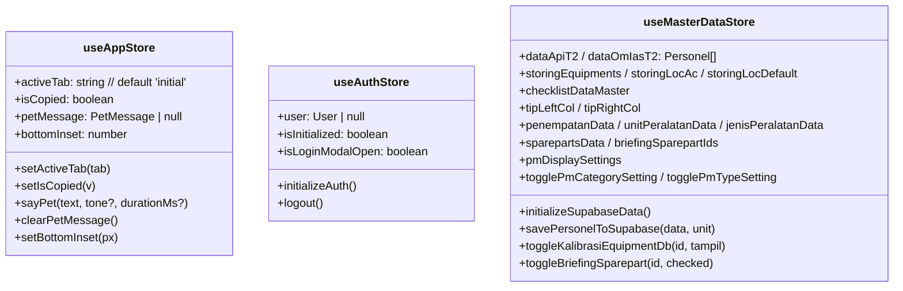

# System Architecture Document
## SSES T2 Generator Laporan Operasional

> Terakhir diselaraskan dengan kode: **1 Oktober 2026** (141 unit test lulus, build berhasil).

---

## 1. Ikhtisar Arsitektur Sistem

Aplikasi **SSES T2 Generator Laporan** adalah **Single Page Application (SPA) Mobile-First** berbasis **React 19**, **TypeScript 5**, **TanStack Start/Router**, dan **Vite 7** (plugin HTTPS `@vitejs/plugin-basic-ssl` untuk pengembangan). Backend utama adalah **Supabase** (PostgreSQL, Auth, Storage). Foto dokumentasi diunggah ke **Cloudinary** (CDN) dengan cadangan otomatis ke **Supabase Storage**.

```mermaid
graph TD
    User([User / Mobile Browser]) --> UI[React 19 Mobile-First UI\n12 Tab + Swipe Navigation + AntigravityPet]
    UI --> Router[TanStack Router]
    UI --> Store[Zustand Stores\nuseAppStore | useAuthStore | useMasterDataStore]
    UI --> Pure[Modul Murni lib/utils\n*Message.ts · formValidation · lokasiFormat · locationRules]
    UI --> Services[Service Layer\noperationalReportService | cloudinaryService | pdfService | shareService | checklistSyncService]

    Store <--> Supabase[(Supabase\nAuth | PostgreSQL | Storage)]
    Services <--> Supabase
    Store -. fallback data bawaan .-> MasterDefault[masterData.ts\nDefault personel, checklist, TIP]
    Services -. kunci konfigurasi Cloudinary .-> LocalStorage[(localStorage\nsses_cloudinary_*)]

    Services --> CloudStorage{Foto dual-tier\ncloudinaryService.ts}
    CloudStorage -->|Primary| Cloudinary[(Cloudinary CDN\nFolder: SSES_T2_Dokumentasi)]
    CloudStorage -->|Fallback| SupabaseStorage[(Supabase Storage\nBucket: dokumentasi)]

    Pure --> WAShare[Web Share API / clipboard + wa.me\nshareService.ts]
    UI --> Canvas[Canvas Engine\ncanvasUtils · LiveCollagePreview · PhotoTextEditorModal · SignaturePad]
    Services --> PDF[html2pdf.js non-blocking\n+ CSS @page terisolasi per tab]
```

---

## 2. Stack Teknologi & Dependensi

| Layer | Teknologi / Library | Versi | Peran |
|---|---|---|---|
| **Core** | React | `19.2.5` | UI library. |
| **Language** | TypeScript | `5.9.3` | Type safety. |
| **Build** | Vite | `7.3.6` | HMR & bundling. |
| **Dev SSL** | `@vitejs/plugin-basic-ssl` | `2.3.0` | HTTPS lokal agar Web Share & Camera API jalan di ponsel (LAN). |
| **Framework** | TanStack Start / Router / router-plugin | `1.168.59` / `1.170.40` / `1.168.41` | Routing type-safe & SSR. |
| **Hosting adapter** | `@netlify/vite-plugin-tanstack-start` | `1.3.14` | Build untuk Netlify. |
| **Styling** | Tailwind CSS (`@tailwindcss/vite`) | `4.2.2` | Utility-first. |
| **State** | Zustand | `5.0.14` | 3 store terpisah. |
| **Database & Auth** | `@supabase/supabase-js` | `2.108.2` | PostgreSQL, Auth (email + kata sandi), Storage. |
| **Foto** | Cloudinary (Unsigned Preset) + Supabase Storage | REST | Upload foto dual-tier. |
| **Canvas** | HTML5 Canvas native | - | Kompresi, kolase, anotasi teks foto, tanda tangan. **Konva sudah dihapus** (dijaga `tests/dependencies-cleanliness.test.mjs`). |
| **Spreadsheet** | SheetJS `xlsx` | `0.18.5` | Parsing Excel jadwal shift & PM di browser. |
| **PDF & cetak** | `html2pdf.js` / `html2canvas` / CSS `@page` | `0.14.0` / `1.4.1` | PDF non-blocking; cetak A4 Landscape (Report) & Portrait (BA). |
| **Ekspor gambar TIP** | `html-to-image` (CDN cdnjs, dimuat saat dibutuhkan) | `1.11.11` | Bukan dependensi npm; dimuat dinamis di `TabTip.tsx`. |
| **Icon** | Lucide React | `0.576.0` | Ikon UI. |
| **Lint** | ESLint 9, typescript-eslint, react-hooks, react-refresh | `9.39.x` | `npm run lint`. |
| **Testing** | Node.js Test Runner | Node 22 | 33 berkas di `tests/`, 141 test. |
| **CI** | GitHub Actions | - | `npm ci` → `npm run lint` → `npm test` → `npm run build` (semua memblokir). |
| **Hosting** | Netlify | - | `publish = dist/client`. |

---

## 3. Struktur Direktori Kode

```
src/
├── components/
│   ├── App.tsx                         # ALL_TABS (12), 8 tab/halaman, swipe, tombol header, mount AntigravityPet
│   ├── features/
│   │   ├── TabKehadiran / TabBriefing / TabStoring / TabChecklist / TabInitialReport / TabPerbaikan
│   │   ├── TabKalibrasi / TabKegiatan / TabBASerahTerima / TabShiftReport (id "report") / TabTip / TabData
│   │   ├── AntigravityPet.tsx          # Maskot; konsumen useAppStore.petMessage & bottomInset
│   │   ├── AssetManager · AssetMasterLokasi · AssetMasterPeralatan · UnitPeralatanManager · SparepartManager
│   │   ├── ScheduleUploader (jadwal shift) → memuat PmScheduleUploader (jadwal PM)
│   │   ├── ChecklistDataEditor + checklist-editor/{BlockCard,CategoryList,SubGroupList,ItemsTextarea,EditorContext,ui}
│   │   ├── CloudinarySettingsPanel
│   │   ├── ba-serah-terima/BADocumentPrint
│   │   ├── kalibrasi/KalibrasiParameterFields
│   │   ├── personel/{PersonelManager,PersonelSection}
│   │   └── shift-report/{ServiceabilityDiagram,ShiftReportCrudModal,ShiftReportPrintDocument}
│   └── shared/                         # FieldError, LiveCollagePreview, MonitorSearchIcon,
│                                       #   PhotoTextEditorModal, PhotoUploader, SignaturePad
├── lib/
│   ├── types.ts                        # tipe domain bersama (lihat §9 butir 5)
│   ├── data/                           # constants, masterData (default + hirarki jabatan), petMessages
│   ├── hooks/                          # useAutoResizeTextarea, usePhotoGroups, useTipePeralatanOptions
│   ├── services/                       # checklistSync, cloudinary, operationalReport, pdf, share
│   ├── utils/                          # modul murni (lihat §6)
│   └── supabaseClient.ts
├── store/                              # useAppStore, useAuthStore, useMasterDataStore
├── routes/                             # __root.tsx, index.tsx ("/" → App)
├── router.tsx · routeTree.gen.ts (generated) · styles.css
tests/                                  # *.test.mjs, dijalankan `node --test`
```

---

## 4. Arsitektur State Management (Zustand)


```mermaid
classDiagram
    class useAppStore {
        +activeTab: string  // default 'initial'
        +isCopied: boolean
        +petMessage: PetMessage | null
        +bottomInset: number
        +setActiveTab(tab)
        +setIsCopied(v)
        +sayPet(text, tone?, durationMs?)
        +clearPetMessage()
        +setBottomInset(px)
    }
    class useAuthStore {
        +user: User | null
        +isInitialized: boolean
        +isLoginModalOpen: boolean
        +initializeAuth()
        +logout()
    }
    class useMasterDataStore {
        +dataApiT2 / dataOmIasT2: Personel[]
        +storingEquipments / storingLocAc / storingLocDefault
        +checklistDataMaster
        +tipLeftCol / tipRightCol
        +penempatanData / unitPeralatanData / jenisPeralatanData
        +sparepartsData / briefingSparepartIds
        +pmDisplaySettings
        +initializeSupabaseData()
        +savePersonelToSupabase(data, unit)
        +toggleKalibrasiEquipmentDb(id, tampil)
        +toggleBriefingSparepart(id, checked)
        +togglePmCategorySetting / togglePmTypeSetting
    }
```

1. **`useAppStore`** — state UI transient: tab aktif, status "tersalin", dan **kanal tunggal maskot** (`petMessage` + `sayPet()`; juga pintasan `sayPet` di luar React untuk service layer). Nada pesan `info | success | warning | error | cheer` menentukan warna dan durasi; `error` menetap sampai ditutup. `bottomInset` memberi tahu maskot agar bergeser di atas bilah simpan yang menempel (`setBottomInset`).
2. **`useAuthStore`** — sesi **Supabase Auth** (email + kata sandi) untuk membuka tab **Data**. Menyimpan `user`, bukan flag `isAdmin`; login di `TabData.tsx` (`AdminLogin`) memanggil `supabase.auth.signInWithPassword`, dan `onAuthStateChange` menjaga sinkron antar-tab browser.
3. **`useMasterDataStore`** — data relasional dan konfigurasi: personel (API T2 & OM IASS, otomatis diurutkan jabatan), master checklist, daftar storing, kolom TIP, penempatan/unit/jenis peralatan, sparepart, pengaturan tampilan PM. `initializeSupabaseData()` memuat dari Supabase saat aplikasi mulai; bila gagal/kosong dipakai **data bawaan `masterData.ts`**. Penulisan konfigurasi lewat `saveConfigToSupabase(key, value)` (upsert `master_configs` by `key`) dan mengembalikan `boolean` agar UI bisa memberi tahu kegagalan.

---

## 5. Service Layer

### 5.1. Log Operasional & Serviceability (`operationalReportService.ts`)
Menyimpan kegiatan shift ke `laporan_operasional` dan ringkasan kelaikan ke `laporan_checklist`; juga menyediakan `fetchOnDutyPersonnel`, `fetchShiftOperationalLogs`, `fetchDailyShiftCounts`, `calculateChecklistSummary`.
* **Batas shift**: PS (Pagi/Siang) 08:00–20:00 WIB; M (Malam) 20:00–08:00 WIB hari berikutnya.
* **Default tanggal/shift laporan**: `00:00–09:59` → kemarin, M · `10:00–21:59` → hari ini, PS · `22:00–23:59` → hari ini, M (`getReportDefaultDateAndShift`).
* **Deduplikasi**: set in-memory `recentOperationalLogs` (jendela 30 detik) mencegah baris ganda saat tombol ditekan berulang.
* **Upsert atomik** `laporan_checklist` memakai unique `(tanggal, shift)`.
* **Persistensi non-blocking**: share dipicu sinkron; upload foto & simpan Supabase berjalan di latar belakang dan hasilnya dilaporkan lewat `sayPet`.

### 5.2. Pipeline Foto Dual-Tier (`cloudinaryService.ts`)
1. **Kompresi Canvas**: JPEG ~80%, sisi terpanjang maks. 1280px (~150–250 KB).
2. **Cloudinary (primary)**: unsigned upload ke folder `SSES_T2_Dokumentasi`. Konfigurasi (cloud name + preset) dibaca berurutan dari memori → `localStorage` (`sses_cloudinary_cloud_name`/`_upload_preset`) → env `VITE_CLOUDINARY_*` → Supabase `master_configs.cloudinary_config` (sumber kebenaran global; diatur di Data → Cloudinary CDN).
3. **Supabase Storage (fallback)**: bila konfigurasi kosong atau upload gagal, foto masuk bucket publik `dokumentasi`; peralihan diumumkan maskot (nada `warning`).
4. **Anti-Base64**: constraint DB `chk_foto_urls_no_base64` menolak `data:image` di `foto_urls`.
5. Alias lama `uploadPhotoToGoogleDrive` masih diekspor sebagai sinonim `uploadPhotoToCloudinary` (sisa migrasi dari Google Drive, September 2026); kode baru memakai `uploadPhotoToCloudinary`.

```
[Kamera/Galeri] → PhotoUploader → (anotasi) PhotoTextEditorModal → LiveCollagePreview (kolase Canvas)
      → cloudinaryService ──► Cloudinary (primary) ─┐
                         └──► Supabase Storage (fallback) ─┤
                                                           ▼
                     URL HTTPS → laporan_operasional.foto_urls / pesan WhatsApp
```

### 5.3. Cetak & PDF (`pdfService.ts` + CSS `@page`)
* Aturan `@page` **tidak boleh** ada di `src/styles.css`; diletakkan di komponen tab masing-masing.
* **Report**: A4 Landscape (`margin: 5mm`), lembar terakhir khusus serviceability (`.serviceability-page-sheet`, ±520px agar tidak melewati tinggi ±766px).
* **BA Serah Terima**: A4 Portrait (`margin: 12mm 15mm`); elemen UI (termasuk maskot) disembunyikan saat cetak (`print:hidden` / `data-html2canvas-ignore`).
* `generatePdfBlob` memuat `html2pdf.js` via dynamic import dan tidak memblokir thread UI; page break memakai mode CSS (`before: '.serviceability-page-sheet'`).

### 5.4. Berbagi WhatsApp (`shareService.ts`)
`shareToWhatsApp(message, files, setIsCopied)`: menyalin teks ke clipboard tanpa `await`, memakai `navigator.share` (dengan berkas bila `canShare`) di bawah user gesture; `fallbackShare` menyalin teks, membuka `https://wa.me/?text=…`, dan mengunduh berkas agar bisa dilampirkan manual.

### 5.5. Sinkronisasi Checklist (`checklistSyncService.ts`)
Membaca/menulis `master_configs.checklist_shift_data` (status checklist per shift) dan toggle aktif (`checklist_active_toggles`), termasuk `saveStoringToChecklistSync` dan `saveChecklistSupervisorDirect` dari tab Storing.

---

## 6. Modul Murni (`src/lib/utils/`) — Pola Utama

Logika yang bisa dipisahkan dari DOM/store/jaringan ditulis sebagai **modul murni** supaya diuji langsung dengan `node --test` (impor `.ts` bertipe-strip, lihat penulisan `./x.ts` pada impor).

| Modul | Tanggung jawab |
|---|---|
| `waGenerator.ts` | Pintu masuk generator WA; re-ekspor `generateWA_Perbaikan/Kehadiran/Briefing/Kegiatan` dan memuat Storing, Checklist, Kalibrasi, Initial Report, BA Serah Terima, Report (`generateWA_ShiftReport`). |
| `kehadiranMessage` · `briefingMessage` · `perbaikanMessage` · `kegiatanMessage` · `shiftReportMessage` | Format pesan per tab; `shiftReportMessage` juga mengklasifikasi baris laporan (preventive/storing/corrective) dan mengurutkan personel (`sortPersonelRows`). |
| `formValidation` | Validator per tab (`validateKehadiran`, `validateBriefing`, `validateChecklist`, `validateStoring`, `validateKegiatan`, `validateBASerahTerima`, `validateInitialReport`, `validatePerbaikan`, `validateKalibrasi`) → daftar `MissingField {key,label}`. |
| `missingFields` | `reportMissingFields`: maskot menyebut isian kosong + `focusFirstMissing` (cari `data-field`/`name`, gulir, fokus). Dipadukan dengan `FieldError` di UI. |
| `lokasiFormat` | Standar `"<Lokasi> <Nomor>"` (`formatLokasi`, `normalizeLokasi`, `formatLokasiRows`, `formatACLokasiList`, `formatStoringLokasi`). |
| `locationRules` | Relasi peralatan ↔ lokasi ↔ titik, opsi dropdown, kunci shift saat ini, pemetaan storing → checklist. |
| `kalibrasiParams` | Baris parameter X-Ray/WTMD (nilai kosong tetap kosong; Archive default `+- 1 bulan`). |
| `initialReportShortcuts` | Shortcut permasalahan/mitigasi/dampak per peralatan × lokasi. |
| `pmScheduleParser` | Parse Excel jadwal PM → `jadwal_pm`, filter PM aktif, bangun *Rencana Kegiatan* Preventive Mingguan/Bulanan. |
| `checklistEditor` | Operasi struktur editor Checklist Config (blok, sub-grup, kategori, pencarian, statistik, deteksi *dirty*). |
| `canvasUtils` | Kompresi gambar, overlay teks, kolase foto. |
| `dateFormat` · `errorUtils` | Format tanggal Indonesia; pesan/penanda error. |

---

## 7. Alur Generator Pesan WhatsApp

```
Form State (React)
  ──► validate<Tab>(data)  ── kosong? ──► reportMissingFields (maskot + fokus + FieldError) ── berhenti
  ──► generateWA_<Tab>(data, master)      (modul murni *Message.ts / waGenerator.ts)
  ──► shareToWhatsApp(...)  (navigator.share instan / fallback clipboard + wa.me)
  ──► [latar belakang] kompres foto → upload Cloudinary/Supabase → saveOperationalLog → sayPet(hasil)
```

Tab **Kalibrasi** dan **Report** menampilkan *preview* WhatsApp yang tingginya mengikuti panjang pesan.

---

## 8. Integrasi Backend (Supabase)

Skema lengkap dan terverifikasi ada di [`database.md`](database.md). Ringkas:
- **Tabel dipakai frontend**: `jenis_peralatan`, `tipe_peralatan`, `lokasi`, `titik_lokasi`, `penempatan_peralatan`, `unit_peralatan`, `spareparts`, `unit_kerja`, `personel`, `jadwal_shift`, `jadwal_pm`, `laporan_operasional`, `laporan_checklist`, `master_configs`.
- **Tabel ada tetapi belum dipakai frontend**: `stock_mutations`, `sparepart_compatibility`.
- **Storage**: bucket publik `dokumentasi`.
- RLS aktif pada seluruh tabel `public`. Master data relasional (`jenis/tipe_peralatan`, `lokasi`, `titik_lokasi`, `penempatan_peralatan`, `personel`, `unit_kerja`) hanya bisa diubah pengguna login; **namun** tabel operasional dan beberapa tabel lain (`laporan_*`, `jadwal_pm`, `jadwal_shift`, `spareparts`, `unit_peralatan`, `master_configs`) saat ini punya kebijakan tulis terbuka — lihat catatan keamanan di [`database.md`](database.md#6-catatan-keamanan-rls).
- Klien memakai kunci anonim (`VITE_SUPABASE_ANON_KEY`); login admin di tab Data memakai Supabase Auth.

---

## 9. Infrastruktur, Pengujian & Keamanan

1. **Environment Variables**: `VITE_SUPABASE_URL`, `VITE_SUPABASE_ANON_KEY`, `VITE_CLOUDINARY_CLOUD_NAME`, `VITE_CLOUDINARY_UPLOAD_PRESET` (kedua Cloudinary opsional bila diatur lewat panel admin). `.env*` di-ignore git.
2. **HTTPS lokal**: Web Share API dan Camera API membutuhkan secure context; Vite dikonfigurasi `server.https` + `basicSsl()`.
3. **Mobile viewport**: `viewport-fit=cover`; font input min. 16px untuk mencegah auto-zoom iOS Safari.
4. **Pengujian (`npm test`, 33 berkas / 141 test)** mencakup antara lain:
   - Format WA per tab: `wa-briefing`, `wa-checklist-title`, `wa-kalibrasi-title`, `wa-perbaikan`, `wa-shift-report`, `wa-preview-height`.
   - Aturan bisnis: `ba-shift-calculation`, `on-duty-technicians`, `lokasi-format`, `kalibrasi-params`, `initial-report-shortcuts`, `pm-schedule-kehadiran`, `form-validation`, `format-nama-personel`.
   - Struktur/regresi komponen: `tab-*`, `checklist-editor-*`, `personel-manager`, `photo-uploader-consolidation`, `print-header-logo`, `set-is-copied-declared`, `share-report`, `shift-report-refactor`, `auto-resize-textarea`, `pet-messages`, `cloudinary-settings`.
   - Kebersihan: `dead-code-cleanliness`, `dependencies-cleanliness` (mencegah dependensi mati seperti Konva kembali).
5. **Kualitas kode**: `npm run lint` bersih (0 error, 0 peringatan) dan memblokir CI. Tipe data bersama ada di `src/lib/types.ts` (personel, peralatan/penempatan, data form tiap tab, `ShiftReportRow`, `Photo`, parameter kalibrasi); modul murni dan komponen memakainya alih-alih `any`. `npx tsc --noEmit` belum ada di CI; satu error tersisa di `vite.config.ts` (`server.https: true` tidak sesuai tipe Vite 7, tidak diubah karena menyangkut dev server HTTPS).
   * *Batas data Supabase*: klien `supabase` belum bertipe (`createClient` tanpa `Database`), sehingga relasi to-one di-embed (mis. `unit_kerja(nama)`) terbaca sebagai array padahal runtime-nya objek. Hasil query tersebut di-cast `as unknown as <TipeDomain>` pada batas pembacaan (`useMasterDataStore`, `TabKehadiran`, `TabShiftReport`, `operationalReportService`, manajer aset). Menyertakan tipe `Database` hasil `supabase gen types` adalah langkah lanjutan yang menghapus cast itu.
6. **Status keamanan dependensi (`npm audit`)**:
   * **`xlsx` (SheetJS) `0.18.5` — risiko diterima secara sadar.** Dua advisory `high`: Prototype Pollution ([GHSA-4r6h-8v6p-xvw6](https://github.com/advisories/GHSA-4r6h-8v6p-xvw6), diperbaiki di 0.19.3) dan ReDoS ([GHSA-5pgg-2g8v-p4x9](https://github.com/advisories/GHSA-5pgg-2g8v-p4x9), diperbaiki di 0.20.2). Tidak ada perbaikan di npm karena SheetJS berhenti publish ke npm sejak 0.18.5.
     * *Mitigasi*: parsing hanya di browser, dan satu-satunya jalur unggah (`ScheduleUploader.tsx`, `PmScheduleUploader.tsx`) ada di tab **Data** yang memerlukan login admin.
     * *Jalur perbaikan*: pasang rilis `0.20.x` dari CDN resmi SheetJS (`https://cdn.sheetjs.com/xlsx-0.20.3/xlsx-0.20.3.tgz`) atau mirror terpelihara `@e965/xlsx`.
   * **`extract-zip` & `sharp`** — hanya perkakas pengembangan (transitif dari `@netlify/vite-plugin-tanstack-start` → `@netlify/dev`), tidak ikut bundel produksi.
   * Gunakan `npm audit --omit=dev` untuk memeriksa yang benar-benar terkirim ke pengguna.
7. **Knowledge graph**: `graphify-out/` (lokal, di-ignore git) memetakan relasi file/fungsi/dokumen; lihat README.
