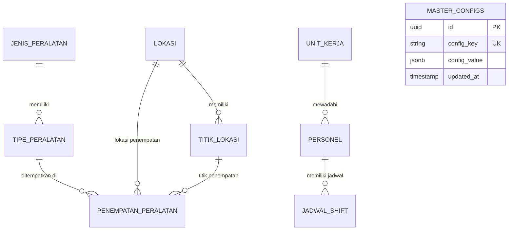

# Database & Data Schema Specification
## SSES T2 Generator Laporan Operasional

---

## 1. Ringkasan Arsitektur Data

Aplikasi **SSES T2 Generator Laporan** menerapkan arsitektur data hibrida (*Hybrid Data Architecture*):

1. **Cloud Database (Supabase PostgreSQL)**: Menyimpan master data terstruktur, relasi peralatan-lokasi, data personel, jadwal shift, serta catatan performa TIP.
2. **Spreadsheet Backend (Google Sheets & Apps Script)**: Menyimpan rekapitulasi histori laporan harian operasional dan lampiran gambar di Google Drive.
3. **Local Storage Fallback**: Menyimpan draf formulir pengguna dan data master lokal di peramban pengguna (*offline resilience*).

---

## 2. Diagram Relasi Entitas (ERD - Supabase PostgreSQL)



---

## 3. Spesifikasi Skema Tabel PostgreSQL (Supabase)

### 3.1. Tabel `jenis_peralatan`
Menyimpan kategori/jenis umum peralatan keamanan di bandara.

| Nama Kolom | Tipe Data | Kunci | Keterangan |
|---|---|---|---|
| `id` | `UUID` / `BIGINT` | **PK** | Identifier unik jenis peralatan. |
| `nama_jenis` | `VARCHAR(100)` | **NOT NULL** | Nama jenis (misal: X-Ray, WTMD, Body Scanner, ETD, HHMD, Access Control). |
| `deskripsi` | `TEXT` | NULL | Penjelasan tambahan jenis peralatan. |
| `created_at` | `TIMESTAMPTZ` | DEFAULT `now()` | Waktu pembuatan data. |

---

### 3.2. Tabel `tipe_peralatan`
Menyimpan merk, tipe, atau varian spesifik dari suatu jenis peralatan.

| Nama Kolom | Tipe Data | Kunci | Keterangan |
|---|---|---|---|
| `id` | `UUID` / `BIGINT` | **PK** | Identifier unik tipe peralatan. |
| `id_jenis` | `UUID` / `BIGINT` | **FK** | Referensi ke `jenis_peralatan(id)`. |
| `nama_tipe` | `VARCHAR(150)` | **NOT NULL** | Nama merk/tipe (misal: Rapiscan 620DV, Heimann HI-SCAN 6040i, Nuctech). |
| `brand` | `VARCHAR(100)` | NULL | Merk manufaktur. |
| `spesifikasi` | `TEXT` | NULL | Catatan spesifikasi teknis peralatan. |
| `created_at` | `TIMESTAMPTZ` | DEFAULT `now()` | Waktu pembuatan data. |

---

### 3.3. Tabel `lokasi`
Menyimpan daftar nama lokasi atau area utama di Terminal 2 Bandara Soekarno-Hatta.

| Nama Kolom | Tipe Data | Kunci | Keterangan |
|---|---|---|---|
| `id` | `UUID` / `BIGINT` | **PK** | Identifier unik lokasi. |
| `nama_lokasi` | `VARCHAR(150)` | **NOT NULL** | Nama lokasi (misal: SSCP D, HBSCP E, SCP Main Gate, Arrival, Departure). |
| `kode_lokasi` | `VARCHAR(50)` | NULL | Kode singkat area/lokasi. |
| `created_at` | `TIMESTAMPTZ` | DEFAULT `now()` | Waktu pembuatan data. |

---

### 3.4. Tabel `titik_lokasi`
Menyimpan nomor titik atau gate spesifik dari suatu lokasi area.

| Nama Kolom | Tipe Data | Kunci | Keterangan |
|---|---|---|---|
| `id` | `UUID` / `BIGINT` | **PK** | Identifier unik titik lokasi. |
| `id_lokasi` | `UUID` / `BIGINT` | **FK** | Referensi ke `lokasi(id)`. |
| `nomor_titik` | `VARCHAR(50)` | **NOT NULL** | Nomor titik (misal: Titik 1, Gate 2, Line 3, Pos 5). |
| `keterangan` | `TEXT` | NULL | Catatan khusus posisi titik. |
| `created_at` | `TIMESTAMPTZ` | DEFAULT `now()` | Waktu pembuatan data. |

---

### 3.5. Tabel Pivot `penempatan_peralatan`
Menghubungkan tipe peralatan dengan lokasi dan titik penempatannya secara relasional dinamis.

| Nama Kolom | Tipe Data | Kunci | Keterangan |
|---|---|---|---|
| `id` | `UUID` / `BIGINT` | **PK** | Identifier unik penempatan. |
| `id_tipe` | `UUID` / `BIGINT` | **FK** | Referensi ke `tipe_peralatan(id)`. |
| `id_lokasi` | `UUID` / `BIGINT` | **FK** | Referensi ke `lokasi(id)`. |
| `id_titik` | `UUID` / `BIGINT` | **FK** | Referensi ke `titik_lokasi(id)`. |
| `status` | `VARCHAR(50)` | DEFAULT `'Aktif'` | Status operasional penempatan (Aktif / Storing / Non-Aktif). |
| `created_at` | `TIMESTAMPTZ` | DEFAULT `now()` | Waktu pemasangan/pencatatan. |

---

### 3.6. Tabel `unit_kerja`
Menyimpan daftar unit kerja operasional.

| Nama Kolom | Tipe Data | Kunci | Keterangan |
|---|---|---|---|
| `id` | `UUID` / `BIGINT` | **PK** | Identifier unik unit kerja. |
| `nama_unit` | `VARCHAR(100)` | **NOT NULL** | Nama unit (misal: API T2, OM/IAS T2). |
| `deskripsi` | `TEXT` | NULL | Keterangan tugas unit kerja. |
| `created_at` | `TIMESTAMPTZ` | DEFAULT `now()` | Waktu pembuatan data. |

---

### 3.7. Tabel `personel`
Menyimpan data anggota personel teknisi SSES T2.

| Nama Kolom | Tipe Data | Kunci | Keterangan |
|---|---|---|---|
| `id` | `UUID` / `BIGINT` | **PK** | Identifier unik personel. |
| `nama` | `VARCHAR(150)` | **NOT NULL** | Nama lengkap personel. |
| `nik` | `VARCHAR(50)` | NULL | Nomor Induk Karyawan / NIK. |
| `phone` | `VARCHAR(20)` | NULL | Nomor WhatsApp / kontak. |
| `id_unit` | `UUID` / `BIGINT` | **FK** | Referensi ke `unit_kerja(id)`. |
| `role` | `VARCHAR(50)` | DEFAULT `'Teknisi'`| Peran (Teknisi / Leader / Admin). |
| `status` | `VARCHAR(20)` | DEFAULT `'Aktif'` | Status keanggotaan. |
| `created_at` | `TIMESTAMPTZ` | DEFAULT `now()` | Waktu pendaftaran. |

---

### 3.8. Tabel `jadwal_shift`
Menyimpan alokasi jadwal shift harian personel teknisi yang dapat diunggah dari berkas Excel.

| Nama Kolom | Tipe Data | Kunci | Keterangan |
|---|---|---|---|
| `id` | `UUID` / `BIGINT` | **PK** | Identifier unik jadwal shift. |
| `tanggal` | `DATE` | **NOT NULL** | Tanggal tugas shift (YYYY-MM-DD). |
| `id_personel` | `UUID` / `BIGINT` | **FK** | Referensi ke `personel(id)`. |
| `shift` | `VARCHAR(20)` | **NOT NULL** | Kode shift (Pagi / Siang / Malam / Off / Cuti / Special). |
| `created_at` | `TIMESTAMPTZ` | DEFAULT `now()` | Waktu pencatatan. |

---

### 3.9. Tabel `master_configs` (JSONB)
Menyimpan konfigurasi fleksibel dan data agregat dalam format JSONB.

| Nama Kolom | Tipe Data | Kunci | Keterangan |
|---|---|---|---|
| `id` | `UUID` | **PK** | Identifier unik konfigurasi. |
| `config_key` | `VARCHAR(100)` | **UNIQUE** | Kunci identifikasi unik (misal: `checklist_config`, `storing_config`, `tip_performance_data`). |
| `config_value` | `JSONB` | **NOT NULL** | Payload JSON sesuai jenis `config_key`. |
| `updated_at` | `TIMESTAMPTZ` | DEFAULT `now()` | Waktu pembaruan konfigurasi terakhir. |

---

## 4. Struktur Payload JSONB (`master_configs`)

### 4.1. Payload `checklist_config`
```json
{
  "categories": [
    {
      "name": "X-Ray Security",
      "items": [
        { "id": "chk_xr_1", "label": "Pemeriksaan Power & Indikator LED", "defaultStatus": "OK" },
        { "id": "chk_xr_2", "label": "Pemeriksaan Conveyor Belt & Emergency Stop", "defaultStatus": "OK" }
      ]
    }
  ]
}
```

### 4.2. Payload `tip_performance_data`
```json
{
  "records": [
    {
      "id": "tip_2026_07_001",
      "bulan": "2026-07",
      "personelName": "Budi Santoso",
      "hit": 45,
      "miss": 3,
      "falseAlarm": 1,
      "totalProjection": 49,
      "scorePercentage": 91.8,
      "updatedAt": "2026-07-27T10:00:00Z"
    }
  ]
}
```

---

## 5. Integrasi Google Sheets Backend (`Code.gs`)

Google Apps Script berfungsi menerima HTTP POST/GET request dari frontend untuk pencatatan laporan harian.

### 5.1. Skema Sheet `Laporan_Harian`

| Kolom | Indeks | Nama Header | Tipe Data | Keterangan |
|---|---|---|---|---|
| A | 1 | Tanggal | `String` (YYYY-MM-DD) | Tanggal laporan. |
| B | 2 | Waktu | `String` (HH:mm) | Jam kejadian/pencatatan. |
| C | 3 | Shift | `String` | Kode shift (Pagi/Siang/Malam). |
| D | 4 | Jenis | `String` | Jenis laporan (Kegiatan, Perbaikan, Initial Report, Storing). |
| E | 5 | Teknisi | `String` | Nama personel penanggung jawab. |
| F | 6 | Lokasi | `String` | Nama lokasi penempatan. |
| G | 7 | Peralatan | `String` | Nama/tipe peralatan terkait. |
| H | 8 | Uraian | `String` | Deskripsi rinci kegiatan/gangguan. |
| I | 9 | TindakLanjut | `String` | Langkah penanganan yang telah dilakukan. |
| J | 10 | Status | `String` | Status akhir (Normal / Gangguan / Monitoring). |
| K | 11 | Drive_Image_ID | `String` | File ID Google Drive foto dokumentasi. |
| L | 12 | Foto_Preview | `Formula` | `=IMAGE("https://drive.google.com/uc?export=view&id=FILE_ID")` |

---

## 6. Penyimpanan Lokal (`localStorage` Key Schema)

| Key Name | Tipe | Deskripsi |
|---|---|---|
| `sses_admin_auth` | `Boolean` | Flag status login admin pada tab Data. |
| `sses_master_data_cache` | `Object JSON` | Cache offline master data untuk mencegah lag UI jika Supabase slow-response. |
| `sses_active_tab` | `String` | Tab UI aktif yang terakhir dibuka pengguna. |
| `sses_tip_data_draft` | `Object JSON` | Draft sementara pengisian TIP performance. |
