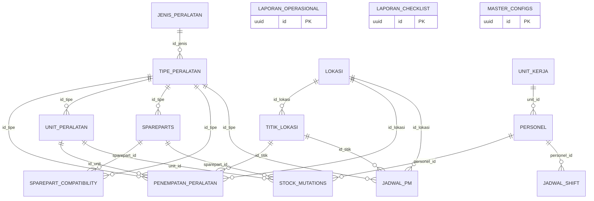

# Database & Data Schema Specification
## SSES T2 Generator Laporan Operasional

> Skema di bawah ini **diverifikasi terhadap database Supabase live** (proyek "SSES T2 Project", Postgres 17, region `ap-southeast-2`) pada **1 Oktober 2026**. Jumlah baris adalah hitungan `count(*)` pada tanggal itu.
> Repositori ini tidak menyimpan berkas migrasi SQL; skema dikelola langsung di Supabase. Bila skema berubah, perbarui dokumen ini.

---

## 1. Ringkasan Arsitektur Data

1. **Supabase PostgreSQL** — master data relasional, personel, jadwal shift & PM, log operasional, ringkasan kelaikan, dan konfigurasi fleksibel (`master_configs`).
2. **Media Foto** — Cloudinary (primary, folder `SSES_T2_Dokumentasi`) dengan cadangan **Supabase Storage** bucket `dokumentasi`. Database hanya menyimpan URL HTTPS.
3. **Browser** — `localStorage` hanya untuk kredensial Cloudinary (§5). Bila Supabase tidak terjangkau, `useMasterDataStore` memakai **data bawaan `src/lib/data/masterData.ts`**; draf formulir **tidak** disimpan ke `localStorage`.

---

## 2. Diagram Relasi Entitas


```mermaid
erDiagram
    JENIS_PERALATAN ||--o{ TIPE_PERALATAN : "id_jenis"
    LOKASI ||--o{ TITIK_LOKASI : "id_lokasi"

    TIPE_PERALATAN ||--o{ PENEMPATAN_PERALATAN : "id_tipe"
    LOKASI ||--o{ PENEMPATAN_PERALATAN : "id_lokasi"
    TITIK_LOKASI ||--o{ PENEMPATAN_PERALATAN : "id_titik"
    UNIT_PERALATAN ||--o{ PENEMPATAN_PERALATAN : "id_unit"
    TIPE_PERALATAN ||--o{ UNIT_PERALATAN : "id_tipe"

    TIPE_PERALATAN ||--o{ SPAREPARTS : "id_tipe"
    SPAREPARTS ||--o{ SPAREPART_COMPATIBILITY : "sparepart_id"
    TIPE_PERALATAN ||--o{ SPAREPART_COMPATIBILITY : "id_tipe"
    SPAREPARTS ||--o{ STOCK_MUTATIONS : "sparepart_id"
    UNIT_PERALATAN ||--o{ STOCK_MUTATIONS : "unit_id"
    PERSONEL ||--o{ STOCK_MUTATIONS : "personel_id"

    UNIT_KERJA ||--o{ PERSONEL : "unit_id"
    PERSONEL ||--o{ JADWAL_SHIFT : "personel_id"

    LOKASI ||--o{ JADWAL_PM : "id_lokasi"
    TITIK_LOKASI ||--o{ JADWAL_PM : "id_titik"
    TIPE_PERALATAN ||--o{ JADWAL_PM : "id_tipe"

    LAPORAN_OPERASIONAL { uuid id PK }
    LAPORAN_CHECKLIST { uuid id PK }
    MASTER_CONFIGS { uuid id PK }
```

`laporan_operasional`, `laporan_checklist`, dan `master_configs` berdiri sendiri (tanpa foreign key).

---

## 3. Spesifikasi Tabel (schema `public`)

Semua `id` bertipe `uuid` default `gen_random_uuid()`. RLS aktif di semua tabel (lihat §6).

### 3.1. `jenis_peralatan` (9 baris)
| Kolom | Tipe | Keterangan |
|---|---|---|
| `id` | uuid **PK** | |
| `nama` | varchar, **UNIQUE** | Jenis (X-Ray, WTMD, Body Scanner, ETD, HHMD, Access Control, Extension Conveyor, …). |
| `tampil_di_kalibrasi` | bool, default `false` | Menentukan jenis yang muncul di dropdown tab Kalibrasi (diatur di Data → Config Peralatan Kalibrasi). |

### 3.2. `tipe_peralatan` (16 baris)
| Kolom | Tipe | Keterangan |
|---|---|---|
| `id` | uuid **PK** | |
| `id_jenis` | uuid FK → `jenis_peralatan.id` | |
| `nama` | varchar, **UNIQUE** | Nama merk/tipe (mis. "X-Ray Rapiscan 628DV"). Dipakai dropdown *Peralatan* (`useTipePeralatanOptions`). |
| `varian` | text, nullable | Mis. Cabin / Bagasi. |

### 3.3. `lokasi` (42 baris)
| Kolom | Tipe | Keterangan |
|---|---|---|
| `id` | uuid **PK** | |
| `nama` | varchar, **UNIQUE** | Nama lokasi/area (PSCP D, HBSCP, Rampout E, …). |

### 3.4. `titik_lokasi` (164 baris)
| Kolom | Tipe | Keterangan |
|---|---|---|
| `id` | uuid **PK** | |
| `id_lokasi` | uuid FK → `lokasi.id` | |
| `nomor` | varchar | Nomor titik. **UNIQUE `(id_lokasi, nomor)`**. |

### 3.5. `penempatan_peralatan` (202 baris)
Pivot yang menempatkan tipe/unit peralatan di lokasi & titik.
| Kolom | Tipe | Keterangan |
|---|---|---|
| `id` | uuid **PK** | |
| `id_tipe` | uuid FK → `tipe_peralatan.id` | |
| `id_lokasi` | uuid FK → `lokasi.id` | |
| `id_titik` | uuid FK → `titik_lokasi.id` | |
| `id_unit` | uuid FK → `unit_peralatan.id`, nullable | Unit fisik yang terpasang. |
| `is_active` | bool, default `true` | |
| `created_at` | timestamptz | |

### 3.6. `unit_peralatan` (135 baris)
| Kolom | Tipe | Keterangan |
|---|---|---|
| `id` | uuid **PK** | |
| `id_tipe` | uuid FK → `tipe_peralatan.id`, NOT NULL | |
| `serial_number` | varchar | |
| `no_sertifikasi` | varchar | |
| `tahun_instalasi` | int | |
| `ampere` | varchar | |
| `milik` | varchar, default `'Injourney / AP2'` | Kepemilikan aset. |
| `status` | varchar, default `'operasi'`, **CHECK** ∈ `operasi \| standby \| gudang \| rusak` | |
| `catatan`, `foto_url` | text | |
| `created_at`, `updated_at` | timestamptz | |

### 3.7. `spareparts` (4 baris)
| Kolom | Tipe | Keterangan |
|---|---|---|
| `id` | uuid **PK** | |
| `sku` | varchar, **UNIQUE** | |
| `name` | varchar | |
| `description` | text | |
| `id_tipe` | uuid FK → `tipe_peralatan.id` | |
| `unit` | varchar, default `'PCS'` | Satuan. |
| `minimum_stok` | int, default `1`, **CHECK ≥ 0** | |
| `lokasi`, `rack` | varchar | Lokasi/rak penyimpanan. |
| `mtbf_days` | int, default `180` | |
| `last_replaced_at` | timestamptz | |
| `created_at`, `updated_at` | timestamptz | |

> Sparepart yang tampil di tab **Briefing** tidak ditandai lewat kolom, melainkan daftar id di `master_configs.briefing_spareparts` (§4).

### 3.8. `sparepart_compatibility` & `stock_mutations` (0 baris)
Ada di database tetapi **belum dipakai frontend** saat ini.
* `sparepart_compatibility`: `sparepart_id` → `spareparts`, `id_tipe` → `tipe_peralatan`, `is_primary` (default `true`); **UNIQUE `(sparepart_id, id_tipe)`**.
* `stock_mutations`: `sparepart_id` (NOT NULL), `unit_id`, `personel_id`, `mutation_type` **CHECK** ∈ `Masuk | Pakai | Bekas | Rusak | Serah Terima`, `qty` **CHECK > 0**, `notes`, `sumber` (default `'VENDOR'`), `location`, `penerima`, `unit_penerima`, `created_at`.

### 3.9. `unit_kerja` (2 baris)
| Kolom | Tipe | Keterangan |
|---|---|---|
| `id` | uuid **PK** | |
| `nama` | text, **UNIQUE** | Dua baris: `API T2` dan `OM/IAS T2`. Nilai ini dipakai apa adanya untuk memisahkan personel di store (tampilan aplikasi menulisnya "OM IASS T2"). |
| `created_at` | timestamptz | |

### 3.10. `personel` (22 baris)
| Kolom | Tipe | Keterangan |
|---|---|---|
| `id` | uuid **PK** | |
| `nik` | text, **UNIQUE** | |
| `nama` | text | |
| `no_hp` | text | |
| `unit_id` | uuid FK → `unit_kerja.id` | |
| `jabatan` | varchar | Supervisor, Engineer, Technician, Teknisi, Pembantu Teknisi, … |
| `urutan` | int | Urutan manual untuk jabatan yang sama (diubah dengan tombol naik/turun di Data → Personel). |
| `created_at` | timestamptz | |

Urutan tampil personel: hirarki jabatan, lalu `urutan` (`sortPersonelByJabatan` di `masterData.ts`); dipakai sama di tab Kehadiran dan Report.

> Sumber daftar personel di aplikasi adalah tabel ini (digabung dengan `unit_kerja.nama`); data bawaan `masterData.ts` hanya dipakai bila query gagal atau kosong. `savePersonelToSupabase` menulis perubahan dari Data → Personel.

### 3.11. `jadwal_shift` (617 baris)
| Kolom | Tipe | Keterangan |
|---|---|---|
| `id` | uuid **PK** | |
| `personel_id` | uuid FK → `personel.id` | |
| `tanggal` | date | |
| `shift` | text | Kode shift (PS / M / Off / Cuti / …). |
| `status_kehadiran` | text, default `'Hadir'` | |
| `created_at` | timestamptz | |
| | **UNIQUE `(personel_id, tanggal)`** | Satu jadwal per personel per hari (upload Excel melakukan upsert). |

### 3.12. `jadwal_pm` (761 baris)
Jadwal Preventive Maintenance (hasil upload Excel di Data → Upload Jadwal Excel → PM), dipakai tab Kehadiran untuk *Rencana Kegiatan*.
| Kolom | Tipe | Keterangan |
|---|---|---|
| `id` | uuid **PK** | |
| `tanggal` | date | |
| `bulan`, `tahun` | int | Upload per bulan: baris bulan/tahun yang sama dihapus lalu diisi ulang. |
| `lokasi` | text | Lokasi (nama standar Supabase). |
| `titik` | text, default `'-'` | |
| `jenis`, `tipe` | text | Jenis & tipe peralatan. |
| `kategori_pm` | text | "PM Mingguan" / "PM Bulanan" (disaring oleh `pm_display_settings`). |
| `shift` | text, nullable | |
| `id_lokasi`, `id_titik`, `id_tipe` | uuid FK, nullable | Diperkaya dari master (`enrichRecordsWithSupabaseIds`). |
| `created_at` | timestamptz | |

### 3.13. `laporan_operasional` (176 baris)
Log kegiatan shift (Perbaikan, Storing, Kegiatan, Kalibrasi, …).
| Kolom | Tipe | Keterangan |
|---|---|---|
| `id` | uuid **PK** | |
| `tanggal` | date | |
| `shift` | varchar | `'PS'` / `'M'`. |
| `jenis` | varchar | Jenis kegiatan. |
| `waktu`, `lokasi`, `peralatan`, `teknisi` | varchar, default `'-'` | |
| `kategori_maintenance` | varchar, default `'CORRECTIVE'` | `CORRECTIVE`, `PREVENTIVE`, `STORING`, … |
| `uraian`, `tindak_lanjut` | text, default `'-'` | |
| `status` | varchar, default `'Normal Operasi'` | |
| `foto_urls` | jsonb, default `[]` | Array URL HTTPS. **CHECK `chk_foto_urls_no_base64`**: `NOT foto_urls::text LIKE '%data:image%'`. |
| `created_at` | timestamptz | |

### 3.14. `laporan_checklist` (8 baris)
| Kolom | Tipe | Keterangan |
|---|---|---|
| `id` | uuid **PK** | |
| `tanggal` | date | |
| `shift` | varchar | |
| `summary` | jsonb, default `[]` | Ringkasan kelaikan `[{ no, nama, total, operasi, rusak, persenOperasi, persenRusak }]`. |
| `created_at` | timestamptz | |
| | **UNIQUE `uq_laporan_checklist_tanggal_shift (tanggal, shift)`** | Untuk upsert atomik. |

### 3.15. `master_configs` (9 baris)
Penyimpanan key–value JSONB untuk konfigurasi dan data agregat.
| Kolom | Tipe | Keterangan |
|---|---|---|
| `id` | uuid **PK** | |
| `key` | text, **UNIQUE** | Kunci (§4). *Bukan* `config_key`. |
| `value` | jsonb | Payload. *Bukan* `config_value`. |
| `updated_at` | timestamptz | |

Semua penulisan memakai `upsert({ key, value, updated_at }, { onConflict: 'key' })`.

### 3.16. Supabase Storage — bucket `dokumentasi`
| Parameter | Nilai |
|---|---|
| `id` / `name` | `dokumentasi` |
| `public` | `true` (URL permanen via HTTPS) |
| Isi | JPEG terkompresi (maks. 1280px, kualitas ±80%, ±150–250 KB); hanya dipakai bila Cloudinary tidak tersedia. |
| Policy | `Public Access` pada `storage.objects`: `ALL` untuk `bucket_id = 'dokumentasi'`. |

---

## 4. Kunci `master_configs`

| Key | Tipe | Pemilik / pembaca | Keterangan |
|---|---|---|---|
| `master_api_t2`, `master_om_ias_t2` | array | *(legacy)* | Sisa dari sebelum personel dipindah ke tabel `personel`; tidak dibaca kode saat ini. |
| `master_checklist` | array | `ChecklistDataEditor`, `TabChecklist` | Struktur master checklist (blok `location` / `group` / `access_control`, sub-grup, kategori, item). |
| `checklist_active_toggles` | object | `TabChecklist` (Realtime) | Toggle aktif checklist. |
| `checklist_shift_data` | object | `checklistSyncService` | Status checklist per shift (disinkronkan juga dari tab Storing). |
| `briefing_spareparts` | array of id | `useMasterDataStore`, `SparepartManager`, `TabBriefing` | Sparepart yang tampil di Briefing. |
| `pm_display_settings` | object | `useMasterDataStore`, `PmScheduleUploader`, `TabKehadiran` | `{ categories: {'PM Mingguan','PM Bulanan'}, types: {X-Ray, WTMD, Body Scanner, ETD, Extension Conveyor, Access Control} }` (boolean). |
| `cloudinary_config` | object | `cloudinaryService`, `CloudinarySettingsPanel` | Cloud name + upload preset (sumber kebenaran global). |
| `tip_data_<Bulan>_<Tahun>` | object | `TabTip`, Data → Data TIP Tersimpan | Mis. `tip_data_Agustus_2026`: `{ items: {...}, lastSaved }`. |
| `master_storing_equip`, `master_storing_loc_ac`, `master_storing_loc_default`, `master_tip_left`, `master_tip_right` | array | `useMasterDataStore` | Dibuat saat admin mengubah daftar terkait; belum ada di database pada tanggal verifikasi (memakai data bawaan). |

Contoh `pm_display_settings`:
```json
{
  "categories": { "PM Mingguan": true, "PM Bulanan": true },
  "types": { "X-Ray": true, "WTMD": true, "Body Scanner": true, "ETD": true, "Extension Conveyor": true, "Access Control": true }
}
```

---

## 5. Penyimpanan Lokal (`localStorage`)

| Key | Keterangan |
|---|---|
| `sses_cloudinary_cloud_name` | Cloud Name Cloudinary (cache dari `cloudinary_config`). |
| `sses_cloudinary_upload_preset` | Unsigned Upload Preset (cache). |

Selain itu, token sesi Supabase Auth dikelola otomatis oleh `@supabase/supabase-js`. Sisa data TIP lama (`tip_data_*`) dihapus dari `localStorage` saat tab TIP dibuka karena TIP kini hanya tersimpan di Supabase.

---

## 6. Catatan Keamanan (RLS)

Ringkasan kebijakan RLS pada tanggal verifikasi — dicatat apa adanya sebagai temuan, bukan rekomendasi desain:

| Tabel | Baca | Tulis |
|---|---|---|
| `jenis_peralatan`, `tipe_peralatan`, `lokasi`, `titik_lokasi`, `penempatan_peralatan`, `personel`, `unit_kerja` | publik | hanya pengguna login (`auth.uid() IS NOT NULL`) |
| `jadwal_shift` | publik | kebijakan "Auth can …" **dan** kebijakan `*_public` (`true`) → praktis **terbuka untuk publik** |
| `jadwal_pm`, `laporan_operasional`, `laporan_checklist` | publik | **terbuka untuk publik** (insert/update/delete `true`) — aplikasi menyimpan laporan sebagai tamu (tanpa login), sehingga tulis publik diperlukan oleh desain saat ini |
| `spareparts`, `sparepart_compatibility`, `stock_mutations` | publik | **terbuka** (`ALL` untuk `anon, authenticated`) |
| `unit_peralatan` | publik | `ALL` dengan `true` (nama kebijakan "Allow all for authenticated", tetapi tidak membatasi) |
| `master_configs` | publik | kebijakan "Allow public read access" bertipe `ALL` dengan `true` → **siapa pun dengan kunci anon dapat menulis konfigurasi** (termasuk `cloudinary_config`) |
| `storage.objects` (`dokumentasi`) | publik | publik |

Konsekuensi: perlindungan tab **Data** hanya berlaku di sisi UI untuk tabel yang kebijakannya terbuka. Bila ingin memperketat, kandidat pertama adalah `master_configs` (batasi tulis ke `authenticated`, kecuali kunci yang memang ditulis tamu seperti `checklist_*` dan `tip_data_*`) dan `jadwal_*`/`spareparts`/`unit_peralatan` (tulis hanya `authenticated`).
